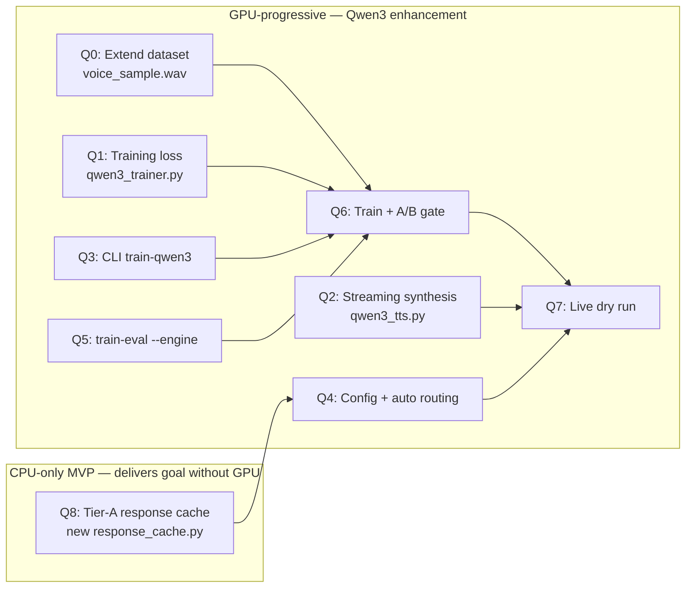

# Qwen3-TTS Migration — Task Decomposition

Source PRD: `docs/PRD-qwen3-tts.md`. Parent goal: `docs/voice-identity.md`.

Each task follows **Plan → Do → Verify**. Plan is the approach the agent must confirm before touching code. Do is the concrete diff scope. Verify is the hard exit criterion — no green Verify, no merge.

## Precondition — CPU-only MVP must ship first

Per `docs/PRD-qwen3-tts.md` §9 step 0, **no Qwen3 task (Q1–Q7) starts until the CPU-only MVP from `docs/voice-identity.md` §Execution order steps 1–5 has passed its 7 / 10 A/B gate**. That MVP is: clean re-record of the dataset via `saymo train-prepare`, XTTS v2 fine-tune on the expanded set, A/B validation, ship Q8 (Tier-A response cache) for CPU-only real-time, and reliability hardening.

Q8 below is the one task from this decomposition that belongs to the CPU-only MVP and must land **before** Q1–Q7. The rest are GPU-progressive enhancement.

## Dependency graph



## Parallelization plan

| Wave | Tasks | Mode | Blocks | Tier |
|---|---|---|---|---|
| 0 | Q8 (+ clean re-record + XTTS v2 fine-tune + A/B) | sequential, no GPU | §9 step 1 | CPU-only MVP |
| 1 | Q0, Q1, Q2, Q3, Q4, Q5 | parallel (6 agents), GPU expected | — | Tier B (optional) |
| 2 | Q6 | sequential, needs Q0+Q1+Q3+Q5 | release to §3 | Tier B |
| 3 | Q7 | sequential, needs Q2+Q4+Q6 | rollout (PRD §9) | Tier B |

Q0, Q1, Q2 touch completely disjoint files (`dataset.py` / `qwen3_trainer.py` / `qwen3_tts.py`) — safe to run in parallel. Q3, Q4, Q5 each touch `cli.py`, so they merge sequentially **inside wave 1** (one PR at a time into wave-1 branch) but research/design can run in parallel. Q4 integrates the Tier-A cache from Q8 as its fallback — so Q8 must land before Q4.

## Audio inventory (what already exists on disk)

| Asset | Path | Size | Role now | Role after Q0 |
|---|---|---|---|---|
| Reference sample | `~/.saymo/voice_samples/voice_sample.wav` | 5 min, 22.05 kHz mono | zero-shot reference only (`qwen3_tts.py:20,45`) | + included in training |
| Primary dataset | `~/.saymo/training_dataset/` | 320 train + 35 eval, ~37 min | XTTS / Qwen3 training | unchanged |
| Raw source | `~/.saymo/youtube_source/source.wav` | ~3 h, 485 MB | already chunked into primary dataset | unchanged |

No other user-recorded audio was found on this machine. Saymo does not write log files to disk — logging goes through Python `logging` to stdout (see `logger = logging.getLogger("saymo.<module>")` convention in `CLAUDE.md`).

## Global constraint — CPU-only compatibility (PRD G6 / §5.5)

**Hard rule:** every task must keep Saymo working on a machine **without** Apple Silicon GPU / MLX. Apple Silicon GPU is not weak in raw compute (M1 ≈ 2.6 TFLOPS, M1 Pro up to 5.3 — comparable to GTX 1660), but framework support is fragmented (MLX works, PyTorch MPS broken for many models). Graceful degradation is a requirement, not an optimisation.

**What this means per task:**

- All MLX imports (`mlx.core`, `mlx_audio.*`) must be guarded by `try/except ImportError` at module load. Expose a `HAS_MLX_GPU` flag; engine factory branches on it.
- Log the resolved device on first TTS call: `Device: GPU` or `Device: CPU (MLX fallback)`.
- `tts.require_gpu: bool` (default `false`) in config — when `true`, refuse to start without GPU (production footgun guard).
- `saymo train-qwen3` is the **only** hard-refuse path on CPU (training would take 10–20 h — fail fast with an actionable message instead).
- Real-time Q&A in `_auto()` auto-downgrades to cached playback when GPU missing; no exceptions reach the user.
- Tests must pass on a CPU-only environment (exclude only the training task).

The Verify section of Q1, Q2, Q4, Q6 below includes an explicit CPU-only check.

---

## Q8 — Tier-A response cache (CPU-only real-time Q&A)

**Tier:** CPU-only MVP · **Owner:** 1 agent · **Est:** 2 days · **Blocks:** Q4 (Q4 wires Tier-A as its CPU fallback), PRD §9 step 1

**Context.** The goal in `docs/voice-identity.md` §Success Criteria includes "spontaneous question → spoken answer in ≤ 8 s". On CPU-only machines, live synthesis through XTTS v2 takes 6–12 s per sentence — misses the budget and leaves the call hanging. Tier-A solves this by pre-synthesising a small library of answers to common standup follow-ups in the user's XTTS v2 fine-tuned voice, then looking them up at runtime instead of synthesising live. Latency drops to playback-only (~100 ms). This path **works without GPU** and becomes the permanent CPU fallback even after Qwen3 ships.

### Plan

1. Define a small prompt library (start with ~20–30 entries) of typical follow-up intents on stand-up calls — e.g. `status_generic`, `blockers_none`, `blockers_dependency`, `eta_not_ready`, `eta_eow`, `help_needed`, `defer_offline`. Each entry has: intent key, trigger keywords / regex, 1–2 short answer texts in Russian.
2. Library lives under `config.responses.*` (overridable in `config.yaml`, per `CLAUDE.md` no-hardcoded-content rule). Default library lives next to the code as `DEFAULT_RESPONSE_LIBRARY` in `saymo/analysis/response_cache.py` (new module).
3. At `saymo prepare` time, pre-synthesise all library entries through the configured `tts.engine` (XTTS v2 fine-tuned by default), cache WAV bytes under `~/.saymo/audio_cache/responses/<intent_key>_<variant>.wav`.
4. At runtime inside `_auto()`, when the intent classifier returns `specific_question`, look up the best-matching library entry. If found with confidence above a threshold, play the cached WAV. If not, fall back to the generic cached standup audio (current default behaviour).
5. Add a graceful fallback semantic: even when Tier-B (Qwen3-TTS) is available and chosen in `tts.realtime_engine`, if Tier-B synthesis fails or takes > `safety.max_synth_wait` seconds, fall back to Tier-A.

### Do

- New module: `saymo/analysis/response_cache.py` — `ResponseCache` class with `build(engine)`, `lookup(transcript_window: str) -> CachedResponse | None`, and `play(response, device)` methods.
- New CLI command: `saymo prepare-responses` in `saymo/cli.py` that instantiates `ResponseCache`, iterates the library, synthesises each entry through the current `tts.engine`, and writes to `~/.saymo/audio_cache/responses/`.
- Extend `saymo prepare` to call `prepare-responses` as a sub-step (can be disabled via a flag).
- Add `config.responses` schema in `saymo/config.py` — dataclass with `library: dict[str, ResponseEntry]` and overrides.
- Document overrides in `config.example.yaml` with at least 5 example entries.
- Prompts/responses follow the `DEFAULT_RESPONSE_LIBRARY` + `config.responses.<key>` pattern, matching the `DEFAULT_*_PROMPT_*` rule in `saymo/speech/ollama_composer.py`. No personal names, no project codenames in defaults — those stay in user's local `config.yaml`.

### Verify

1. `saymo prepare-responses` successfully synthesises every entry in `DEFAULT_RESPONSE_LIBRARY` on a CPU-only machine using XTTS v2. Output files exist under `~/.saymo/audio_cache/responses/`.
2. Unit test: `ResponseCache.lookup("а что по тестам?")` returns a `CachedResponse` with intent `status_generic` (or matching key) at confidence ≥ 0.6; `lookup("как погода?")` returns `None`.
3. Integration: `_auto()` with mocked classifier returning `specific_question` + mock transcript matching `status_generic` plays the cached WAV within 500 ms (wall clock) of the classifier decision.
4. Fallback chain: when cache miss, `_auto()` plays the generic prepared standup audio (current behaviour preserved); no exception raised.
5. **CPU-only check (PRD G6).** Everything above must pass on a machine where MLX GPU is unavailable.

**Done when:** Verify 1–5 pass and `saymo prepare` pre-generates the full response library as part of the normal prepare flow. A user on a CPU-only install can complete a stand-up with spontaneous follow-ups answered by cached Tier-A audio, no GPU anywhere in the path.

---

## Q0 — Extend training dataset with `voice_sample.wav`

**Owner:** 1 agent · **Est:** 0.5 day · **Blocks:** Q6

**Context.** `~/.saymo/voice_samples/voice_sample.wav` (5 min, 22.05 kHz mono) is currently used **only** as a zero-shot cloning reference (see `saymo/tts/qwen3_tts.py:20,45` — `DEFAULT_VOICE_SAMPLE`). It is not part of the training set. Unlike the current `training_dataset/` which is sliced from a 3-hour YouTube recording (acoustic quality of web-published talk: some reverb / background / variable distance from mic), `voice_sample.wav` is a direct microphone capture — cleaner acoustics per minute. Adding it gives LoRA 5 extra minutes of high-SNR material and a second acoustic condition, which usually improves similarity more than equivalent minutes of noisier audio (see `docs/voice-identity.md` §A.1).

Dataset size goes from 320 → roughly 360–380 training segments, ~42 min.

### Plan

1. Reuse the existing dataset-building pipeline in `saymo/tts/dataset.py` — it already does VAD segmentation, SNR filtering, transcription via Whisper, and metadata.csv writing. Do **not** hand-roll a parallel pipeline.
2. Point it at `voice_sample.wav` as a second source, **append** (not overwrite) to the existing `~/.saymo/training_dataset/{raw,wavs,eval/wavs}` and `metadata.csv`.
3. Use a non-colliding ID range. Current IDs run up to `0354` (seen in `metadata.csv` tail). Start the new segments at `0400` so there is a clean gap that identifies the second source in future debugging.
4. Keep the 90/10 train/eval split consistent — hold out ~10% of the new segments into `eval/`.
5. Regenerate `dataset_report.json` (`dataset.py` already writes it; just re-run).

### Do

- If `dataset.py` has a reusable `DatasetBuilder.ingest(source_wav: Path, id_offset: int)` style entry point: call it directly in a short script under `scripts/` or extend the existing `saymo train-prepare` flow with a `--source <path>` flag.
- If no such entry point exists, add a thin method (keep diff small, ≤ 50 lines) that accepts an arbitrary input wav and an ID offset, and reuses the private VAD/Whisper/QC helpers already in `dataset.py`.
- Do **not** touch the YouTube-derived segments or their IDs.
- Do **not** modify `qwen3_tts.py` — `voice_sample.wav` keeps its zero-shot-reference role in parallel; duplication between training and inference reference is acceptable and commonly beneficial.

### Verify

1. `~/.saymo/training_dataset/dataset_report.json` — `total_segments` and `train_segments` strictly larger than the pre-Q0 values (355 / 320); `total_duration_sec` grows by ~280 s (5 min × 0.95 accept rate).
2. `head ~/.saymo/training_dataset/metadata.csv` is byte-identical to pre-Q0 (old segments untouched); `grep "^04" metadata.csv | head` shows new `04xx|...` lines with clean Russian transcription.
3. Random-sample listen check on 3 of the new `04xx.wav` files — audio must match the transcription; no clipping, no cut-mid-word artefacts.
4. Running Q6 training after Q0 must succeed without errors related to dataset shape (regression check).

**Done when:** Verify 1–4 pass and `training_dataset/` contains both sources, with `dataset_report.json` reflecting the expanded size.

---

## Q1 — Implement LoRA training loss

**Owner:** 1 agent · **Est:** 1–2 days · **Blocks:** Q6

**Context.** `saymo/tts/qwen3_trainer.py:290-301` contains a placeholder loss (`mx.mean(output)`). Training runs but produces meaningless gradients. This is the single biggest blocker.

### Plan

1. Inspect `mlx_audio.tts.utils.load_model` for the Qwen3-TTS model: does the returned model expose (a) a `forward(text_tokens, audio_tokens) → logits` path, or (b) only `generate(...) → audio`? Read `mlx-audio` source in the local venv.
2. Prefer **Option A** — teacher-forced token cross-entropy over 12 Hz audio tokens (matches the `cheeweijie/qwen3-tts-lora-finetuning` reference). If not accessible, fall back to **Option B** — mel-spectrogram L1 between synthesised and ground-truth audio.
3. Preserve the existing `loss_and_grad_fn = nn.value_and_grad(model, self._compute_loss)` pattern at `qwen3_trainer.py:192`. Do not refactor the training loop.

### Do

- Replace `qwen3_trainer.py:290-301` with the real loss. Keep the `@staticmethod` signature `(model, text, audio_path) -> mx.array`.
- If Option B: add mel-extraction helper in the same file, do not introduce a new module.
- Update the docstring at `qwen3_trainer.py:291` to describe what the loss actually computes.

### Verify

1. Unit check — loss returns `mx.array` scalar, finite, non-zero on any sample from `~/.saymo/training_dataset/`.
2. Gradient check — `nn.value_and_grad` produces non-zero grads on at least one LoRA parameter.
3. Smoke run — `Qwen3VoiceTrainer().train(epochs=1)` completes on a 10-sample subset without exceptions.
4. Loss trajectory — 5-epoch run on the full 320-segment dataset shows final loss < 0.8 × initial loss (PRD metric M2).
5. **CPU-only check (PRD G6).** `saymo train-qwen3` must fail fast on a machine without MLX GPU with an actionable message ("MLX GPU not available; use `saymo train-voice` for XTTS v2") and exit code ≠ 0. No silent 15-hour CPU training. Simulate by setting `MLX_DISABLE_GPU=1` or running in a container without Metal.

**Done when:** `training_log.json` in `~/.saymo/models/qwen3_finetuned/` shows monotonic (±noise) decrease across 5 epochs and Verify 1–5 pass.

---

## Q2 — Streaming synthesis path

**Owner:** 1 agent · **Est:** 1 day · **Blocks:** Q7

**Context.** `saymo/tts/qwen3_tts.py:79-111` writes a full WAV to tmp then reads it. The docstring (line 31) claims streaming support; the code does not implement it. Blocks the 5–7 s end-to-end answer budget in `docs/voice-identity.md` §6.5.

### Plan

1. Inspect `mlx_audio.tts.generate.generate_audio` (used at `qwen3_tts.py:86`). Check whether it supports a generator mode or a `stream=True` kwarg. If not, drop to the lower-level token-decode loop.
2. Decide chunk size — 250–500 ms of audio per flush is the sweet spot (latency vs CPU overhead).
3. Design for cancellation — `Qwen3CloneTTS.stop()` (line 136) must interrupt streaming cleanly.

### Do

- Add `async def synthesize_stream(self, text: str) -> AsyncIterator[bytes]` to `Qwen3CloneTTS` in `saymo/tts/qwen3_tts.py`.
- Add `async def synthesize_stream_to_device(self, text: str, device_name: str)` that pipes chunks into `sounddevice.OutputStream` using `find_device` from `saymo/audio/devices.py`.
- Keep the existing `synthesize()` method unchanged — it is the non-streaming fallback.
- Extend `stop()` at `qwen3_tts.py:136-137` to abort the stream task if active.

### Verify

1. Functional — `async for chunk in engine.synthesize_stream("Тест")` yields at least one non-empty bytes chunk.
2. Latency — time to first chunk ≤ 2 s for a 1-sentence prompt on M1 16 GB (PRD metric M5). Measure 3 runs, report median.
3. Completeness — concatenated chunks reconstruct the same audio as `synthesize()` within ±1 % RMS.
4. Cancellation — calling `stop()` mid-stream ends the iterator within 200 ms.
5. **CPU-only check (PRD G6).** Without MLX GPU, `synthesize_stream` must not raise — acceptable fallback is to return a single chunk (full audio) and log `streaming disabled: no GPU`. `Qwen3CloneTTS.synthesize()` (non-streaming path) must still run on CPU; if it cannot, the engine factory must fall back to XTTS v2. Test by importing the module with `MLX_DISABLE_GPU=1`.

**Done when:** Verify 1–5 pass and a new script or doctest under `tests/tts/` demonstrates the latency.

---

## Q3 — `saymo train-qwen3` CLI command

**Owner:** 1 agent · **Est:** 0.5 day · **Blocks:** Q6

**Context.** The trainer exists (`Qwen3VoiceTrainer`), but there is no CLI entry. `saymo/cli.py:1305` has `train-prepare` and a `train-voice` for XTTS v2 — follow the same pattern.

### Plan

1. Locate the existing `train-voice` command in `saymo/cli.py` and copy its Click decorators and flag conventions.
2. Wire it to `Qwen3VoiceTrainer`, not the XTTS `VoiceTrainer`.
3. Surface progress via the existing `console.print` / `rich` usage in `cli.py`.

### Do

- Add `@main.command("train-qwen3")` in `saymo/cli.py`.
- Flags: `--epochs` (int, default 5), `--rank` (int, default 8), `--scale` (float, default 0.3), `--lr` (float, default 1e-4).
- Reuse the dataset-path detection already in `train-voice` — do not duplicate.
- Pass a `progress_callback` that updates a `rich.progress` bar, matching the `train-voice` UX.

### Verify

1. `saymo train-qwen3 --help` shows the four flags with defaults.
2. `saymo train-qwen3 --epochs 1` on the existing 320-segment dataset runs one full epoch, prints per-step loss, and writes `~/.saymo/models/qwen3_finetuned/best_adapter/` + `training_log.json`.
3. Running without a dataset produces the same error message shape as `train-voice` ("Run `saymo train-prepare` first").

**Done when:** Verify 1–3 pass and the command appears in `saymo --help` output.

---

## Q4 — Config schema + `_auto()` realtime-engine routing

**Owner:** 1 agent · **Est:** 0.5 day · **Blocks:** Q7 · **Requires:** Q8 landed (Tier-A cache is the GPU-missing fallback)

**Context.** `docs/voice-identity.md` §7 specifies `tts.realtime_engine` and `analysis.qa_mode.*`. Neither exists in `saymo/config.py` or `config.example.yaml`. `_auto()` at `saymo/cli.py:192-316` only reads `tts.engine`. The routing must include a graceful fallback chain: Tier-B (Qwen3 GPU) → Tier-A (Q8 response cache) → generic cached standup.

### Plan

1. Extend `SaymoConfig` dataclasses in `saymo/config.py` — add `realtime_engine: str | None = None` under `tts`, default falls back to `tts.engine`.
2. Document the new keys in `config.example.yaml` with comments that explain the default-fallback behaviour.
3. In `_auto()`, pick the engine via `config.tts.realtime_engine or config.tts.engine` at the exact point where the TTS engine is instantiated for a spontaneous-answer path. **Do not** change behaviour for the cached-audio path.

### Do

- Edit `saymo/config.py`: add field, keep existing defaults untouched.
- Edit `config.example.yaml`: new commented block under `tts:`.
- Edit `saymo/cli.py:192-316`: single-line engine selection; guard with `getattr(config.tts, 'realtime_engine', None)` if the attribute might be absent for old configs.
- Update `docs/voice-identity.md` §7 — mark the key as "implemented".

### Verify

1. `SaymoConfig` round-trips through YAML without breakage on an existing `config.yaml` lacking the new key (default-fallback).
2. With `tts.realtime_engine: qwen3_clone` set, `_auto()` instantiates `Qwen3CloneTTS` on the spontaneous-answer branch. Proven by a log line or a lightweight unit test that stubs the classifier and checks the constructed engine class.
3. With the key absent, behaviour is byte-identical to pre-change baseline (regression test).
4. **CPU-only check (PRD G6).** On a machine without MLX GPU, `_auto()` must not crash — on `specific_question` intent with `tts.realtime_engine: qwen3_clone` but no GPU, auto-downgrade to the cached-audio path and log the downgrade. Also implement and test `tts.require_gpu: true` — when set, Saymo startup refuses with a clear message if GPU is unavailable.

**Done when:** Verify 1–4 pass and `docs/voice-identity.md` §7 reflects the key as shipped.

---

## Q5 — `saymo train-eval --engine qwen3`

**Owner:** 1 agent · **Est:** 0.5 day · **Blocks:** Q6

**Context.** Current `saymo train-eval` compares XTTS v2 base vs fine-tuned (`saymo/tts/quality.py`). The A/B gate in PRD §5.4 needs the same blind-comparison UX for Qwen3 zero-shot vs Qwen3 LoRA.

### Plan

1. Read `saymo/tts/quality.py` to understand the current A/B plumbing. Do not rebuild it — extend it.
2. Generalise the "baseline vs candidate" choice so an `--engine` flag selects which engines to compare. Default remains XTTS.
3. For `--engine qwen3`: baseline is `Qwen3CloneTTS` with `lora_adapter=None`; candidate is `Qwen3CloneTTS` with `lora_adapter=~/.saymo/models/qwen3_finetuned/best_adapter/`.

### Do

- Extend the quality module with an `EngineChoice` (or similar) that maps a string flag to (baseline_factory, candidate_factory).
- Add `--engine {xtts,qwen3}` to the `train-eval` command in `saymo/cli.py`; default `xtts` so existing workflow is preserved.
- Report format stays the same (pair count, preference ratio, per-pair samples saved under `~/.saymo/audio_cache/eval/`).

### Verify

1. `saymo train-eval --help` shows the new flag with options and default.
2. `saymo train-eval --engine xtts` is byte-identical to the previous default invocation (regression).
3. `saymo train-eval --engine qwen3` after a Qwen3 training run produces a preference report with ≥ 1 synthesis pair saved.

**Done when:** Verify 1–3 pass. Not required at this stage: that Qwen3 wins — that is Q6's job.

---

## Q6 — Train on dataset + run A/B gate

**Owner:** 1 agent (execution, not code) · **Est:** 1 day · **Needs:** Q0 ✅, Q1 ✅, Q3 ✅, Q5 ✅ · **Blocks:** Q7

**Context.** This is the validation gate in PRD §5.4. No code changes — the task is to run the pipeline end-to-end on real data and decide: promote the adapter, or reject it.

### Plan

1. Confirm dataset readiness: `~/.saymo/training_dataset/dataset_report.json` → `ready: true`, ≥ 340 good segments (grew from 303 after Q0). Confirm both sources are represented (IDs under `04xx` from Q0 present alongside the original `00xx-03xx`).
2. Run 5-epoch LoRA training with defaults (rank 8, scale 0.3, lr 1e-4).
3. Run A/B blind preference against Qwen3 zero-shot.
4. Record the verdict in `docs/voice-identity.md` §A.4.

### Do

```
saymo train-qwen3 --epochs 5
saymo train-eval --engine qwen3
```

### Verify

1. `training_log.json` — final loss < 0.8 × initial loss (PRD M2).
2. A/B preference — fine-tuned preferred in ≥ 7 / 10 pairs (PRD M3).
3. Sanity listen — spot-check 3 random pairs by ear; fine-tune should sound noticeably closer to `voice_sample.wav`.
4. **CPU-only check (PRD G6).** The A/B step (`saymo train-eval --engine qwen3`) must complete on a CPU-only machine using pre-generated samples — evaluation itself must not require GPU. Training itself requires GPU; the train-refuse path from Q1 Verify 5 is the source of truth here.

**Done when:** Verify 1–4 pass. **If not:** do not proceed to Q7. Open a dataset-quality follow-up per PRD §7 Risks (YouTube source suspected as ceiling).

---

## Q7 — Live dry run on a real call

**Owner:** 1 agent (execution) · **Est:** 0.5 day · **Needs:** Q2 ✅, Q4 ✅, Q6 ✅

**Context.** Final end-to-end check before default rollout. Exercises streaming + realtime_engine routing + fine-tuned voice inside `_auto()` during a real meeting.

### Plan

1. Set `tts.engine: qwen3_clone`, `tts.realtime_engine: qwen3_clone`, `analysis.qa_mode.enabled: true` in local `config.yaml` only (not `config.example.yaml`).
2. Do a 1:1 test call (Glip) with a colleague who knows what to expect.
3. Ask 3 planted questions to trigger the spontaneous-answer path.
4. Have a kill-switch ready: `safety.hotkey_stop` or the provider mute button.

### Verify

1. End-to-end latency on each spontaneous answer ≤ 8 s (PRD M6). Measure by stopwatch or call recording timestamps.
2. Zero stuck-mic incidents during the call.
3. Colleague rating: "sounds like you" — yes / mostly / no. Target: "yes" or "mostly" on all three.
4. No fallback to XTTS v2 occurred (check logs for `saymo.tts.coqui_clone` entries during the Q&A path).

**Done when:** Verify 1–4 pass. Proceed to PRD §9 rollout step 3 (flip defaults in `config.example.yaml` after a 2-week clean usage window).

---

## Parallel-agent briefing template

When spawning an agent for task Qx, give it this minimum:

- Link: `docs/PRD-qwen3-tts.md` (full context) and this file (Qx section).
- Scope fence: only the files named in Qx's **Do** section.
- Non-goals: no refactoring outside the scope, no cross-task work, no `CLAUDE.md`-forbidden content (no personal names, no codenames, prompts live as `DEFAULT_*_PROMPT_*` with `config.prompts.<key>` overrides).
- Exit: paste **Verify** results inline. If any Verify step fails, stop and report — do not "fix" by widening scope.

## Status board

| ID | Task | Tier | Status | Owner | PR |
|---|---|---|---|---|---|
| Q8 | Tier-A response cache (CPU-only real-time) | MVP | not started | — | — |
| Q0 | Extend dataset with `voice_sample.wav` | Tier B | blocked on MVP A/B gate | — | — |
| Q1 | Training loss | Tier B | blocked on MVP A/B gate | — | — |
| Q2 | Streaming synthesis | Tier B | blocked on MVP A/B gate | — | — |
| Q3 | `train-qwen3` CLI | Tier B | blocked on MVP A/B gate | — | — |
| Q4 | Config + `_auto()` routing (uses Q8 as fallback) | Tier B | blocked on Q8 + MVP A/B gate | — | — |
| Q5 | `train-eval --engine` | Tier B | blocked on MVP A/B gate | — | — |
| Q6 | Train + A/B gate | Tier B | blocked on Q0, Q1, Q3, Q5 | — | — |
| Q7 | Live dry run | Tier B | blocked on Q2, Q4, Q6 | — | — |

**Legend.** "Tier" column: **MVP** = delivers the goal on CPU-only machines, ships first. **Tier B** = GPU-progressive enhancement for free-form real-time Q&A, optional.
