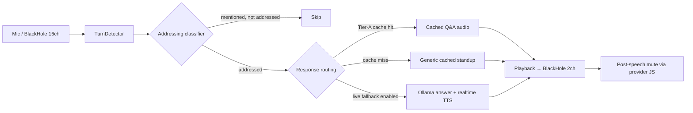

# Voice Identity

## Context & Goal

Saymo must speak in a voice **indistinguishable from the user's own**, and answer spontaneous follow-up questions during live calls without breaking that illusion.

The rest of the pipeline — trigger detection, ASR window, BlackHole routing, 8-provider Chrome automation, prepared playback — is already in place. This document is the single source of truth for the remaining work: closing the voice-similarity gap and extending `auto` mode with real-time answers.

## Success Criteria

1. **Voice similarity**: the fine-tuned voice is preferred in ≥ 7 / 10 blind A/B pairs via `saymo train-eval`.
2. **Prepared playback**: `saymo prepare -p <profile>` → `saymo speak --provider glip` works end-to-end on a real call.
3. **Spontaneous answers**: a question during a call produces a spoken answer in ≤ 8 s on M1 16 GB.
4. **Safety**: zero stuck-mic incidents across a 2-week usage window.

## Current State

What is already shipped (and must be reused, not rebuilt):

| Capability | Implementation |
|---|---|
| Trigger / turn detection | `saymo/analysis/turn_detector.py` — name-variant patterns, sliding window over `_prev_chunk + text`, 45 s cooldown (lines 23–74) |
| Short ASR window | `AudioCapture` — 4 s chunks with 2 s overlap |
| Cached standup playback | `saymo prepare` → `saymo review` → `saymo speak` |
| Mic mute / unmute per app | `saymo/providers/*` — 8 providers via Chrome JS |
| Voice sample recording | `saymo/commands/voice_train.py:13` — `saymo record-voice` |
| Guided training dataset | `saymo/commands/voice_train.py:120` — `saymo train-prepare`; 76 Russian prompts in `saymo/tts/prompts.py` across STATUS / TECH / QUESTION / PANGRAM / EXPRESSIVE categories |
| Dataset builder & quality gates | `saymo/tts/dataset.py` — SNR threshold, clipping detection, 50+ segments / 10+ min minimum (lines 40, 57) |
| XTTS v2 fine-tune loop | `saymo/tts/trainer.py:110-381` — epochs, backward pass, best-checkpoint save |
| Fine-tune auto-load | `saymo/tts/coqui_clone.py:75-133` — picks `~/.saymo/models/xtts_finetuned/best_model.pth` (or `model.pth`); base dir at line 21 |
| A/B blind evaluation | `saymo train-eval` via `saymo/tts/quality.py` |
| Audio routing | BlackHole 2ch (virtual mic) + Multi-Output (monitor) + BlackHole 16ch (capture) |

What is missing for the goal:

| Gap | Evidence | Track |
|---|---|---|
| Real-time Q&A path in `auto` mode | ~~Gap closed in v0.8.0~~ — `saymo/commands/core.py::_auto` + `saymo/commands/__init__.py::_resolve_auto_response` now consult `ResponseCache` on question-shaped triggers and optionally fall back to live Ollama + TTS when `config.responses.live_fallback=true`. | done |
| Trigger setup is still too manual | `saymo trigger-check` now previews trigger/addressing/question/cache routing, but `saymo setup` does not yet walk the user through microphone-based trigger calibration or automatically write fuzzy STT variants. | Setup UX |
| Addressing false positives need ongoing tuning | `saymo/analysis/addressing.py` suppresses obvious narrated mentions like "как Миша говорил...", but more real-call transcripts are needed for edge cases. | Reliability |
| Qwen3-TTS LoRA training loss is a placeholder | `saymo/tts/qwen3_trainer.py::_compute_loss` now raises `NotImplementedError` instead of silently computing `mx.mean(output)`. LoRA scaffolding (rank 8 / scale 0.3; `_apply_lora` via `mlx_lm.tuner.lora.LoRALinear.from_base`) is real. The training loop itself still needs a real loss impl after inspecting the model's forward signature. | A |
| `safety.max_speech_duration` wired into `_auto()` | `_auto()` wraps playback with a timeout and cancels playback when it exceeds `safety.max_speech_duration`. | done |
| Stop/toggle hotkeys bound in `auto` | `_auto()` starts a `pynput.GlobalHotKeys` listener for `safety.hotkey_stop` and `safety.hotkey_toggle`; `hotkey_speak` remains unused because auto-mode speaks on trigger. | partial |

## Architecture (voice-identity slice)



## Track A — Voice Identity

Goal: the cloned voice passes the 7/10 A/B gate.

### A.1 Dataset capture

- Record one long clean sample first: `saymo record-voice -d 300`.
- Then run the guided session: `saymo train-prepare`. It walks through the 76 prompts in `saymo/tts/prompts.py`.
- Recording hygiene: single USB microphone, quiet room, constant distance, constant sample rate, no clipping, no reverb. Discard any clip that fails `saymo/tts/dataset.py` thresholds.
- Minimum viable set: 50 segments, 10 min of clean audio. More is fine, noisier is not — quality beats quantity.

### A.2 XTTS v2 fine-tune (prepared-playback path)

Pipeline is already end-to-end. Use it:

```
saymo train-voice --epochs 5       # ~4–6 h CPU on M1 16 GB
saymo train-eval                   # blind A/B vs base
saymo test-tts "текст" -e coqui_clone
```

The fine-tuned weights are picked up automatically by `saymo/tts/coqui_clone.py:75-133`; no config change needed beyond `tts.voice_training.use_finetuned: true`.

### A.3 Qwen3-TTS LoRA (real-time path)

The LoRA wrapper is in place, but the training loss at `saymo/tts/qwen3_trainer.py:291-301` is a placeholder. Concrete TODO:

1. Inspect the `forward()` signature of `Qwen/Qwen3-TTS-12Hz-1.7B-CustomVoice` in MLX.
2. Replace the placeholder with a real reconstruction loss (mel / token cross-entropy depending on what the model actually exposes).
3. Train on the same dataset as A.2. Keep rank = 8, scale = 0.3 (lines 138–139) unless the A/B gate says otherwise.
4. Target: ~1–2 h on Apple Silicon GPU, ~2–5 M trainable params.

### A.4 Validation gate

Do not promote LoRA weights to `realtime_engine` until `saymo train-eval` reports fine-tuned preferred in ≥ 7 / 10 pairs. This gate applies to both XTTS v2 and Qwen3-TTS.

## Track B — Real-time Q&A

Goal: when the trigger fires on a question rather than a turn call, Saymo composes and speaks an answer in the cloned voice.

### B.1 Addressing and intent classifiers

Shipped deterministic layer: `saymo/analysis/addressing.py` consumes the same transcript window as `_auto()` and returns one of `{addressed_to_me, generic_team_question, mentioned_not_addressed, no_trigger, ignore}`. `_auto()` skips obvious narrated mentions before response resolution.

Optional semantic layer: `config.responses.intent_classifier=true` runs a small Ollama classifier before keyword response-cache matching. It catches rephrasings the keyword matcher misses while preserving the cache-first CPU path.

### B.2 Answer composer

Extend `saymo/speech/ollama_composer.py`. Follow the existing `DEFAULT_*_PROMPT_*` convention (see `CLAUDE.md` architectural rule: prompts are not hardcoded, defaults live next to overridable `config.prompts.<key>`, and `config.example.yaml` documents the override). Inputs to the prompt:

- the extracted question,
- the prepared standup / notes for the current profile,
- the user's name variants (for addressing style).

Output: 1–2 sentences. Truncate at `analysis.qa_mode.max_answer_length`.

### B.3 Real-time TTS

- Primary: Qwen3-TTS on MLX GPU with reference audio (target 2–3 s for 1–2 sentences).
- Fallback: XTTS v2 fine-tuned on CPU (slower, but the A.2 gate guarantees it sounds like the user).

### B.4 Integration point

Branch inside `_auto()` at `saymo/commands/core.py::_auto`. Rules:

- If addressing returns `mentioned_not_addressed`, `no_trigger`, or `ignore`, skip playback and return to listening.
- If the transcript is addressed to the user/team, route through Tier-A response cache first.
- If cache misses and `responses.live_fallback=false`, play the generic prepared standup audio.
- If cache misses and `responses.live_fallback=true`, go through B.2 → B.3.
- Under any failure in the live path, fall back to cached audio if available, else generic prepared standup audio.

### B.5 Latency budget (M1 16 GB)

| Step | Budget |
|---|---|
| Intent classification (small Ollama prompt) | ~1 s |
| Answer generation (e.g. `qwen2.5-coder:7b`) | 2–3 s |
| Real-time TTS (Qwen3-TTS, 1–2 sentences) | 2–3 s |
| **Total** | **5–7 s** |

A 5–7 s pause after a question reads as "thought about it" rather than as machine lag.

## Config shape for target state

```yaml
tts:
  engine: coqui_clone              # prepared playback uses the XTTS fine-tune
  realtime_engine: qwen3_clone     # spontaneous answers use the GPU path
  voice_training:
    use_finetuned: true

analysis:
  turn_detection:
    keyword_trigger: true

safety:
  max_speech_duration: 120
  hotkey_stop: "cmd+shift+x"
  hotkey_toggle: "cmd+shift+m"
  hotkey_takeover: "cmd+shift+u"

responses:
  enabled: true
  confidence_threshold: 0.6
  intent_classifier: false
  live_fallback: false
```

`tts.realtime_engine`, `responses.*`, `safety.max_speech_duration`, stop/toggle/takeover hotkeys, and `scripts/add_hotkeys.py` exist in the repo. A future `analysis.turn_detection.require_confirmation` key can still be added if real-call false positives persist.

## Reliability appendix

Short list of hardening items adjacent to the goal — not blockers for A/B pass, but required before routine use on real calls:

- **Timeout safety**: shipped. `_auto()` cancels playback when it exceeds `safety.max_speech_duration`; provider mute fallback should still be hardened with an AppleScript system-mute fallback if provider control fails.
- **Hotkeys**: shipped for `safety.hotkey_stop`, `hotkey_toggle`, and `hotkey_takeover`; `hotkey_speak` is not used in auto-mode.
- **Trigger diagnostics**: shipped as `saymo trigger-check -p <profile> --text ...` and `saymo trigger-check -p <profile> --mic`.
- **Confirmation step (optional)**: when `analysis.turn_detection.require_confirmation: true`, wait up to 3 s after the first trigger for a second mention before speaking. Helps when false positives appear.
- **Local log review**: after each test session, skim trigger / transcript / answer / mute-state logs; keep them local (the project is `Local by default`).
- **Consent**: clone your own voice only where you have the right to. Disclose automation where workplace policy requires it.

## Execution order

The goal is a product that works on a CPU-only machine and hits "voice indistinguishable" before any GPU-specific work. Steps 1–5 below are the **CPU-only MVP** — no MLX GPU required, no Qwen3-TTS required. Steps 6–8 are **GPU-progressive enhancement** for free-form real-time Q&A; they are optional and only run on machines where MLX GPU is available.

### CPU-only MVP (steps 1–5, delivers the goal)

1. **Clean dataset re-record** — `saymo train-prepare` (76 prompts via USB mic in a quiet room, constant distance, ~25 min of recording). Dataset quality is the single biggest lever for voice similarity; the existing YouTube-derived set caps below the 7 / 10 gate.
2. **XTTS v2 fine-tune on expanded dataset** — `saymo train-voice --epochs 5` → `saymo train-eval`; promote only if ≥ 7 / 10.
3. **Prepared-playback dry run** — `saymo prepare -p <profile>` → `saymo review` → `saymo speak --provider glip` against a real call.
4. **Tier-A response cache** (real-time Q&A on CPU) — shipped. `saymo prepare` rebuilds a small library of pre-synthesised answers for common standup questions; `_auto()` looks up a cached answer before live synthesis. Latency is playback-only when a cache entry exists.
5. **Reliability hardening** — timeout, stop/toggle hotkeys, trigger diagnostics, and addressing false-positive suppression are shipped. Remaining work: optional confirmation step and provider/system mute fallback hardening.

At this point the product meets all four success criteria on a CPU-only machine.

### GPU-progressive enhancement (steps 6–8, optional, requires MLX GPU)

6. **Qwen3-TTS real-time pipeline** — ship B.1 → B.2 → B.3 → B.4 using Qwen3-TTS zero-shot (no LoRA yet); measure against the 5–7 s budget. When MLX GPU is missing, `_auto()` falls back to step 4's Tier-A cache — never fails loudly.
7. **Qwen3-TTS LoRA** — fix the loss at `saymo/tts/qwen3_trainer.py:291-301`, retrain, re-run the A/B gate, then flip `tts.realtime_engine` to the fine-tune.
8. **Defaults flip** — once a 2-week clean usage window passes on GPU machines, update `config.example.yaml` defaults. Tier-A remains as the CPU-only fallback.
